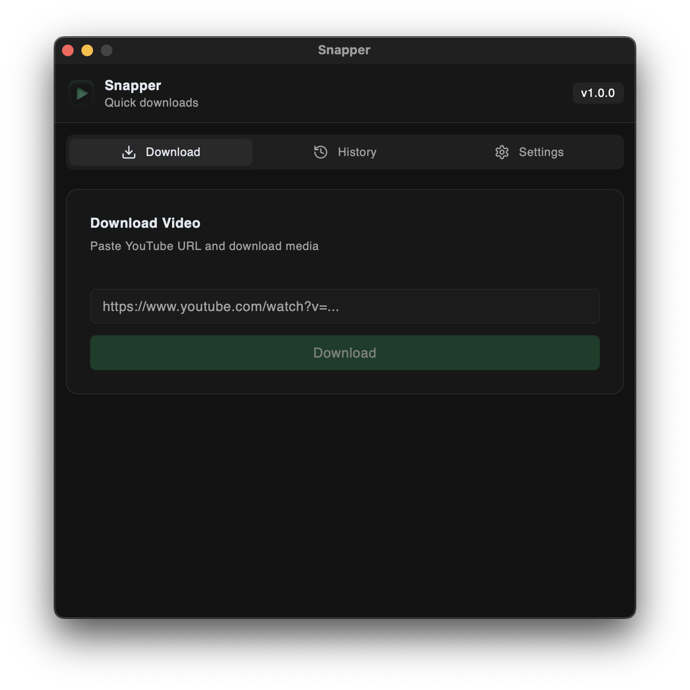

# Snapper

A modern, cross-platform desktop application for downloading YouTube videos and audio built with Tauri, React, and Rust.

## Features

- **Multiple Format Support**: Download videos in MP4, WebM formats or extract audio as MP3, WAV
- **Quality Selection**: Choose from best, high, medium, low, or worst quality options
- **Cross-Platform**: Works on Windows, macOS, and Linux
- **Modern UI**: Clean, responsive interface built with React and Tailwind CSS
- **Download History**: Track all your downloads with status monitoring
- **Progress Tracking**: Real-time download progress updates
- **Customizable Settings**: Set default download paths, formats, and quality preferences
- **URL Validation**: Automatic YouTube URL validation before download
- **Embedded Dependencies**: Includes yt-dlp and ffmpeg binaries for seamless operation

## Screenshots

The application features a clean, three-tab interface:
- **Download**: Main download functionality with URL input and progress tracking
- **History**: View and manage your download history
- **Settings**: Customize download preferences and output directory




## Installation

### Download

1. Go to the [Releases](../../releases) page
2. Download the appropriate version for your operating system:

#### Windows
- **Installer**: `Snapper_1.0.0_x64_en-US.msi` - Recommended
- **Setup**: `Snapper_1.0.0_x64-setup.exe`

#### macOS
- **Intel (x64)**: `Snapper_1.0.0_x64.dmg`
- **Apple Silicon (ARM64)**: `Snapper_1.0.0_aarch64.dmg`
- **App Bundle (Intel)**: `Snapper_x64.app.tar.gz`
- **App Bundle (ARM64)**: `Snapper_aarch64.app.tar.gz`

#### Linux
- **AppImage**: `Snapper_1.0.0_amd64.AppImage` - Universal, no installation required
- **Debian/Ubuntu**: `Snapper_1.0.0_amd64.deb`
- **RPM (Fedora/RHEL)**: `Snapper-1.0.0-1.x86_64.rpm`

### Installation Instructions

#### Windows
1. Download the `.msi` installer (recommended) or `.exe` setup file
2. Run the installer and follow the setup wizard
3. Launch "Snapper" from the Start Menu

#### macOS
1. Download the appropriate `.dmg` file for your Mac:
   - Intel Macs: `x64.dmg`
   - Apple Silicon Macs (M1/M2): `aarch64.dmg`
2. Open the `.dmg` file and drag the app to Applications folder
3. Launch from Applications (you may need to allow the app in Security & Privacy settings)

**Alternative**: Download the `.app.tar.gz` file, extract it, and run directly

#### Linux

**AppImage (Recommended)**
1. Download `Snapper_1.0.0_amd64.AppImage`
2. Make it executable: `chmod +x Snapper_1.0.0_amd64.AppImage`
3. Run directly: `./Snapper_1.0.0_amd64.AppImage`

**Debian/Ubuntu**
```bash
# Download and install
sudo dpkg -i Snapper_1.0.0_amd64.deb
```

**RPM-based (Fedora/RHEL/CentOS)**
```bash
# Install using rpm
sudo rpm -i Snapper-1.0.0-1.x86_64.rpm
```

### Building from Source

#### Requirements

- [Rust](https://rustup.rs/) (latest stable)
- [Node.js](https://nodejs.org/) (v16 or later)
- [Tauri Prerequisites](https://tauri.app/v1/guides/getting-started/prerequisites)

#### Build Steps

1. **Clone the repository**
   ```bash
   git clone https://github.com/66HEX/snapper.git
   cd snapper
   ```

2. **Install frontend dependencies**
   ```bash
   npm install
   ```

3. **Build the application**
   ```bash
   npm run tauri build
   ```

4. **Development mode**
   ```bash
   npm run tauri dev
   ```

## Usage

1. **Launch the application**
2. **Paste a YouTube URL** in the download tab
3. **Select format and quality** (or use your saved preferences)
4. **Choose output directory** (optional - defaults to Downloads folder)
5. **Click Download** and monitor progress
6. **View completed downloads** in the History tab

### Supported URLs

- Standard YouTube videos: `https://www.youtube.com/watch?v=...`
- YouTube Shorts: `https://www.youtube.com/shorts/...`
- Short URLs: `https://youtu.be/...`
- Playlists: `https://www.youtube.com/playlist?list=...`

## Technical Details

### Backend (Rust)

- **Tauri Framework**: Provides secure bridge between frontend and system
- **tokio**: Async runtime for handling downloads
- **serde**: JSON serialization/deserialization
- **chrono**: Date/time handling for download history
- **anyhow**: Error handling
- **uuid**: Unique download ID generation

### Frontend (React + TypeScript)

- **React 18**: Modern React with hooks
- **TypeScript**: Type-safe development
- **Tailwind CSS**: Utility-first styling
- **shadcn/ui**: High-quality UI components
- **Lucide React**: Beautiful icons

### Key Features Implementation

#### Download Management
- Async download processing with status tracking
- Automatic retry logic with fallback strategies
- Cache management and cleanup
- File path validation and sanitization

#### Cross-Platform Binary Detection
- Automatic detection of embedded vs system binaries
- Platform-specific path resolution
- Fallback to common installation paths

#### Settings Persistence
- JSON-based settings storage using Tauri's store plugin
- Auto-save functionality for user preferences
- Default value handling

## Development

### Available Scripts

```bash
# Development server
npm run tauri dev

# Build for production
npm run tauri build

# Frontend development only
npm run dev

# Lint code
npm run lint

# Type checking
npm run type-check
```

### Testing Backend Functions

The application includes a built-in test function accessible via browser console:

```javascript
// Open DevTools and run:
window.testBackend()
```

This will test all backend functionality including dependency checks, URL validation, and video info retrieval.

## License

This project is licensed under the MIT License - see the [LICENSE](LICENSE) file for details.

## Disclaimer

This application is for personal use only. Please respect YouTube's Terms of Service and copyright laws. The developers are not responsible for any misuse of this software.

## Acknowledgments

- [yt-dlp](https://github.com/yt-dlp/yt-dlp) - The powerful YouTube downloader library
- [Tauri](https://tauri.app/) - Secure, fast, and lightweight desktop applications

## Support

If you encounter any issues or have questions:

1. Check the [Issues](../../issues) page for existing problems
2. Create a new issue with detailed information about your problem
3. Include your operating system, application version, and error messages

---

**Made with ❤️ using Tauri, React, and Rust**